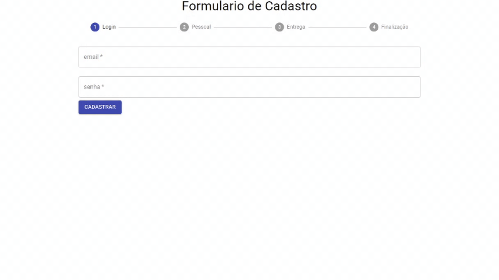

## How it looks


This form is just a showcase of how we can create forms with material ui, it's almost complete as you can see.-

# Here's how to Get Started
### ```git clone https://github.com/L-Goncalves/Form-Material-UI-React.git```

### ```yarn```

### ```cd Form-Material-UI-React```

In the project directory, you can run:

### ```yarn start```

Runs the app in the development mode.\
Open [http://localhost:3000](http://localhost:3000) to view it in the browser.

The page will reload if you make edits.\
You will also see any lint errors in the console.
